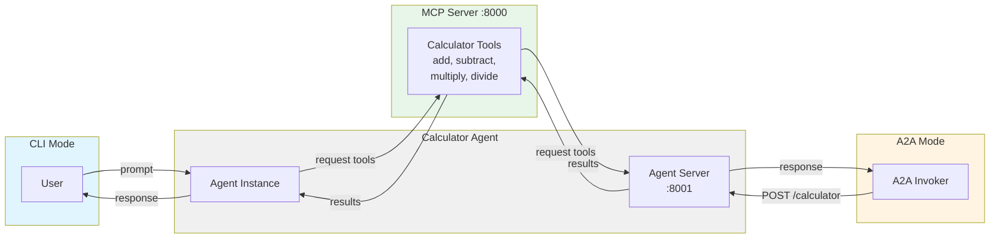

# MCP Server + Agent + Client

This repo contains a simple Model Context Protocol (MCP) calculator server,
an ADK-based agent that uses the MCP tools, and a small Python client.

## Components

- `server/`: FastMCP calculator server exposing `add`, `subtract`, `multiply`, `divide`.
- `calculator_agent/`: Google ADK agent that connects to the MCP server and
  uses a model (Gemini or LiteLLM) to decide when to call tools. Can also run
  as an A2A (Agent-to-Agent) HTTP service.
- `client/`: Minimal MCP HTTP client for quick sanity checks.
- `a2a_invoker/`: Example client that calls the Calculator Agent via A2A protocol.

## How it Works



1. The MCP server exposes calculator tools over HTTP/SSE.
2. The agent connects to the MCP server, wraps tools as ADK function tools,
   and runs an ADK `Agent` via an in-memory runner.
3. The agent can run in CLI mode (direct execution) or A2A server mode (HTTP service).
4. The A2A invoker demonstrates agent-to-agent communication over HTTP.

## Prerequisites

- Python 3.10+
- `uv` (used in the Makefile for virtualenv + installs)
- MCP server running locally for agent/client usage

## Quickstart

```bash
make venv
make server
```

In a second terminal:

```bash
make install-agent
make run-agent ARGS="what is the product of 5 and 10"
```

## Server

```bash
make server
# or
python -m mcp_calculator
```

Default MCP endpoint:
`http://localhost:8000/mcp/`

## Agent

The agent lives in `calculator_agent/` and is run from the repo root.

```bash
make run-agent ARGS="Calculate 5 + 3"
```

### Agent Environment Variables

- `MCP_SERVER_URL`: MCP server URL (default: `http://localhost:8000/mcp/`)
- `API_KEY`: Gemini API key (also used as a fallback for LiteLLM)
- `LLM_PROVIDER`: `gemini` or `litellm`
- `LLM_MODEL`: Model name (for LiteLLM, use `provider/model`)
- `LLM_API_BASE`: Base URL for LiteLLM providers
- `LLM_API_KEY`: API key for LiteLLM (falls back to `OPENAI_API_KEY` or `API_KEY`)
- `LLM_BASE_URL`: Alias for `LLM_API_BASE`

### LiteLLM / Local Models

Example (Ollama):

```bash
make run-agent ARGS="Calculate 5 + 3" \
  LLM_PROVIDER=litellm \
  LLM_MODEL=ollama/llama3 \
  LLM_API_BASE=http://localhost:11434
```

Example (vLLM OpenAI-compatible endpoint):

```bash
make run-agent ARGS="Calculate 5 + 3" \
  LLM_PROVIDER=litellm \
  LLM_MODEL=openai/qwen3-4b-instruct \
  LLM_API_BASE=http://localhost:8000/v1 \
  LLM_API_KEY=your_key
```

## A2A (Agent-to-Agent)

The Calculator Agent can be exposed as an HTTP service following the A2A protocol.

### Running the Agent as a Server

In a new terminal (with the MCP server already running):

```bash
make run-agent-server
```

This starts the agent at `http://localhost:8001` with:
- **Agent Card**: `GET http://localhost:8001/calculator/info`
- **Invoke Agent**: `POST http://localhost:8001/calculator`

### Calling the Agent via A2A Invoker

With the agent server running:

```bash
make run-invoker ARGS="Calculate 10 * 5"
```

The invoker will:
1. Fetch the Agent Card from `/calculator/info`
2. Send the prompt to `/calculator`
3. Display the result

## Client

```bash
cd client
python client.py
```

## Tests

The project includes comprehensive unit tests for all components:

### MCP Server Tests
```bash
make test  # Tests for calculator MCP server
```

### Calculator Agent Tests
```bash
make test-agent  # Tests for agent logic and A2A server
```

Tests cover:
- **Server**: MCP tool registration and functionality
- **Agent**: Agent execution with MCP tools, simple eval mode
- **A2A Server**: Agent Card endpoint, health checks, input validation
- **A2A Invoker**: Agent card retrieval, agent invocation, error handling

### Running All Tests
```bash
.venv/bin/pytest calculator_agent/tests/ -v  # All agent tests
.venv/bin/pytest server/tests/ -v             # MCP server tests  
cd a2a_invoker && ../.venv/bin/pytest test_invoker.py -v  # Invoker tests
```

## Troubleshooting

- MCP connection errors: confirm `make server` is running and `MCP_SERVER_URL`
  points to the correct `/mcp/` endpoint.
- LiteLLM import issues on macOS (arm64): ensure native deps like `tiktoken`,
  `tokenizers`, and `jiter` match your Python architecture.
- vLLM tool calling: if the server rejects `tool_choice=auto`, start vLLM with
  tool-call support or use a model/backend that supports function calling.
